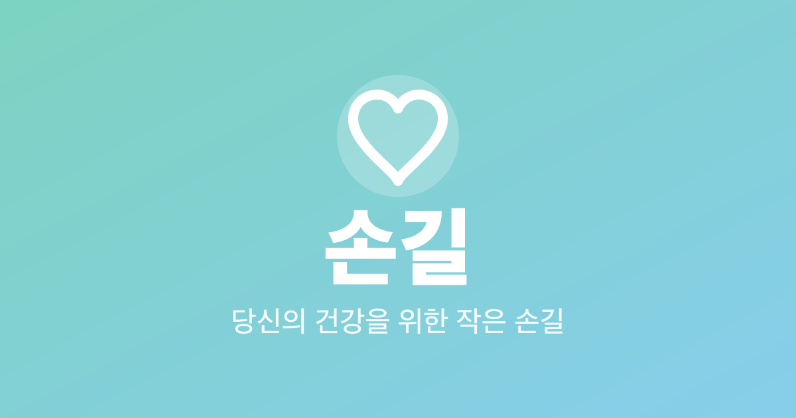
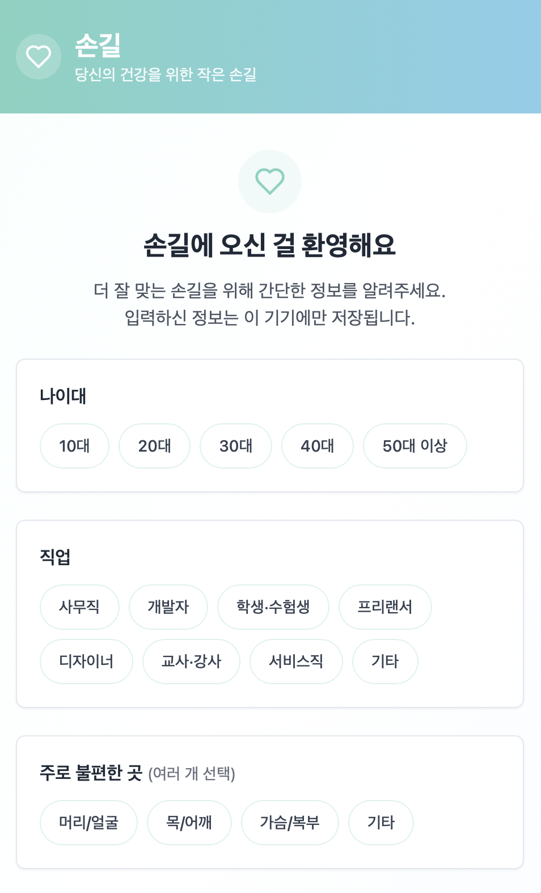
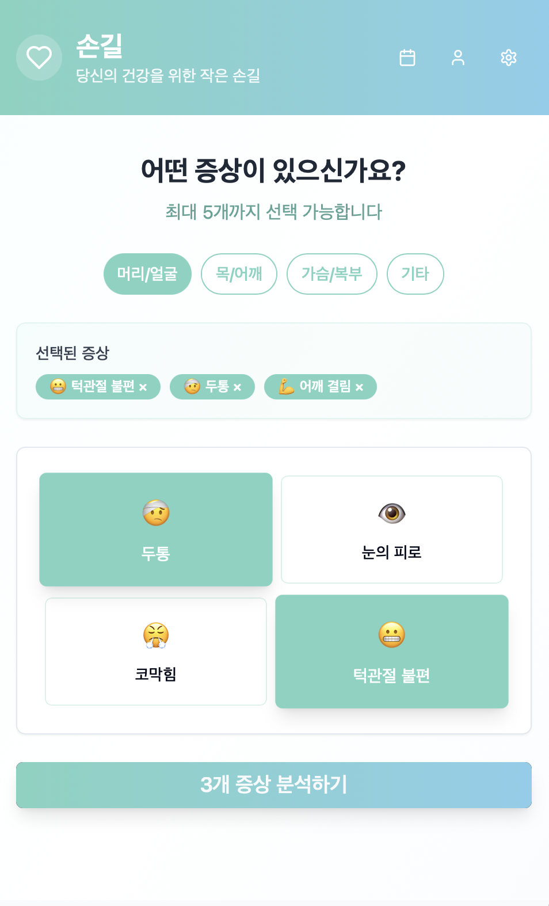
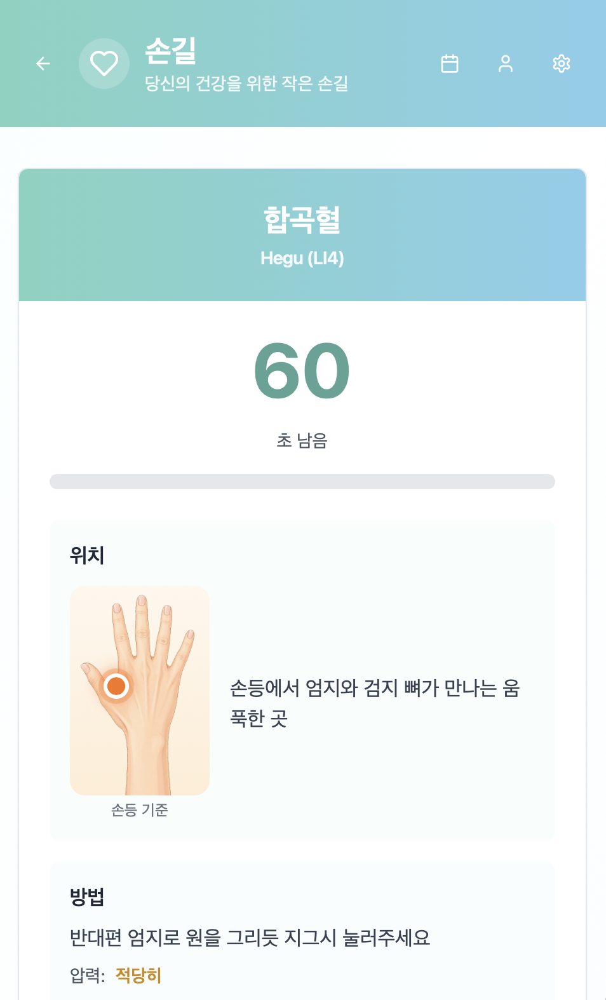
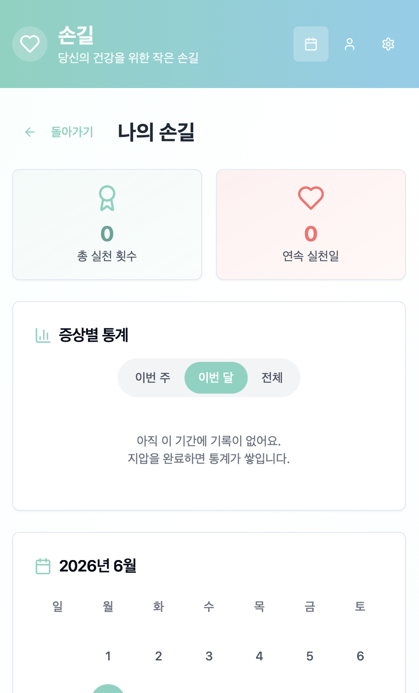

# 손길(SohnGil) ✋

<p align="center">
  
</p>

> 책상에 오래 앉아있는 현대인을 위한 **손바닥 지압 셀프케어 앱** (웹 + Mac 데스크탑)

<div align="center">
  
  
  
  
</div>

<br/>

## 🔗 링크

- 🌐 **웹**: https://sohngil.vercel.app
- 💻 **맥 데스크탑 앱**: [최신 릴리스 다운로드](https://github.com/ShinjungOh/sohngil/releases/latest) (Apple Silicon)

<br/>

## 💻 데스크탑 앱 설치 (macOS · Apple Silicon)

1. [Releases](https://github.com/ShinjungOh/sohngil/releases/latest)에서 `sohngil_x.x.x_aarch64.dmg` 다운로드
2. 열어서 '손길'을 **응용 프로그램** 폴더로 드래그
3. 앱이 **"손상되었기 때문에 열 수 없습니다"** 라고 뜨면, 터미널에서 아래 명령으로 격리 속성을 제거한 뒤 실행하세요:
   ```bash
   xattr -cr /Applications/손길.app
   ```

> 코드 서명·공증을 하지 않은 무료 배포라서 생기는 정상적인 macOS 보안 차단입니다. **파일이 손상된 것은 아닙니다.**

**데스크탑 전용 기능**: 메뉴바 트레이 상주, 지압 리마인더 알림, 타이머 완료 알림음/시스템 알림

<br/>

## 🛠️ 기술 스택

- **프론트엔드**: React 18 · TypeScript · Vite · Tailwind CSS · shadcn/ui · React Router
- **데스크탑**: Tauri 2 (Rust)
- **배포**: Vercel(웹) · GitHub Releases(.dmg)
- **패키지 매니저**: bun

<br/>

## ⚙️ 로컬 실행 / 빌드

```bash
bun install            # 의존성 설치

bun run dev            # 웹 개발 서버 (http://localhost:8080)
bun run build          # 웹 프로덕션 빌드 (dist/)

bun run tauri dev      # 데스크탑 앱 개발 모드
bun run tauri build    # 데스크탑 .dmg 빌드
```

> 데스크탑 개발/빌드에는 [Rust](https://rustup.rs) 툴체인이 필요합니다.

<br/>

## 🎭 페르소나

<details>
<summary>타깃 사용자 페르소나 4명</summary>

<br/>


### 1. 과로한 개발자 - 박지민 (31세)
- **직업**: 스타트업 백엔드 개발자
- **라이프스타일**: 하루 10시간 이상 코딩, 거북목 자세, 야근 빈번
- **목표**: 만성 통증 없이 업무 효율성 유지하기
- **니즈**: 즉각적인 통증 완화, 사무실에서 간편한 셀프케어
- **페인 포인트**: 병원 갈 시간 없음, 목/어깨 만성 통증, 두통

### 2. 수험생 - 이서준 (24세)
- **직업**: 공무원 시험 준비생
- **라이프스타일**: 하루 12시간 독서실, 불규칙한 식사, 운동 부족
- **목표**: 최상의 컨디션으로 집중력 유지하기
- **니즈**: 두통/눈 피로 해소, 스트레스 관리, 소화불량 개선
- **페인 포인트**: 장시간 앉아있음, 시험 스트레스, 컨디션 관리 어려움

### 3. 워킹맘 - 김현정 (38세)
- **직업**: 마케팅 팀장, 두 아이의 엄마
- **라이프스타일**: 출근-회의-육아 반복, 개인 시간 부족
- **목표**: 짧은 시간에 효과적으로 피로 회복하기
- **니즈**: 5분 이내 빠른 케어, 스트레스 해소, 어깨 결림 완화
- **페인 포인트**: 시간 부족, 육아 스트레스, 만성 피로

### 4. 프리랜서 디자이너 - 최민수 (29세)
- **직업**: UI/UX 디자이너
- **라이프스타일**: 재택근무, 불규칙한 생활, 밤샘 작업
- **목표**: 창의력과 집중력을 유지하면서 건강 관리하기
- **니즈**: 눈의 피로 해소, 손목 통증 완화, 두통 관리
- **페인 포인트**: 불규칙한 생활 패턴, VDT 증후군, 운동 부족

</details>

<br/>

## 🎞️ 사용자 시나리오 및 스토리

<details>
<summary>사용 시나리오 4편 · 인사이트</summary>

<br/>

### 1. 개발자의 오후 3시 루틴
**상황**: 박지민이 점심 후 코드 리뷰를 하다가 심한 목 통증과 두통을 느낌

**사용자 시나리오**:
1. 책상에서 손길 앱 실행
2. "목/어깨 결림"과 "두통" 증상 선택
3. "손길 찾기" 버튼 클릭
4. 손바닥의 후계혈, 합곡혈 위치 확인
5. 타이머와 함께 각 지압점 30초씩 지압
6. 5분 후 통증 완화되어 업무 복귀

> **사용자 스토리**:
"개발자로서, 저는 업무 중 빠르게 목 통증을 완화하고 싶습니다. 그래서 병원에 가지 않고도 즉시 통증을 관리하며 코딩에 집중할 수 있습니다."

### 2. 수험생의 새벽 공부 시간
**상황**: 이서준이 새벽 2시 공부 중 극심한 눈의 피로와 집중력 저하를 경험

**사용자 시나리오**:
1. 독서실에서 조용히 손길 앱 오픈
2. "눈의 피로"와 "스트레스" 선택
3. 추천받은 정명혈, 태양혈 확인
4. 이어폰으로 타이머 소리 들으며 지압
5. 시원한 느낌과 함께 다시 집중력 회복
6. "나의 손길" 기록에 저장

> **사용자 스토리**:
"수험생으로서, 저는 공부 중 눈의 피로를 빠르게 해소하고 싶습니다. 그래서 독서실을 벗어나지 않고도 컨디션을 회복할 수 있습니다."

### 3. 워킹맘의 점심시간 케어
**상황**: 김현정이 연속 회의 후 점심시간에 극심한 어깨 결림과 스트레스를 느낌

**사용자 시나리오**:
1. 회사 휴게실에서 손길 앱 실행
2. "어깨 결림"과 "스트레스" 빠른 선택
3. 5분 퀵 케어 모드 선택
4. 견정혈, 내관혈 중심으로 지압
5. 알림 설정으로 오후 3시 리마인더 등록
6. 상쾌한 기분으로 오후 일정 시작

**사용자 스토리**:
"워킹맘으로서, 저는 짧은 휴식 시간에 효과적으로 피로를 풀고 싶습니다. 그래서 업무와 육아를 더 활기차게 할 수 있습니다."

### 4. 프리랜서의 밤샘 작업 중 케어
**상황**: 최민수가 마감을 앞두고 밤샘 작업 중 두통과 손목 통증 발생

**사용자 시나리오**:
1. 작업 중 잠시 손길 앱 오픈
2. "두통", "손목 통증" 선택
3. 손등의 양계혈, 합곡혈 위치 확인
4. 한 손씩 번갈아가며 지압
5. 커피 대신 지압으로 각성 효과
6. 즐겨찾기에 "밤샘 작업 세트" 저장

> **사용자 스토리**:
"프리랜서로서, 저는 작업 중단 없이 통증을 관리하고 싶습니다. 그래서 마감을 지키면서도 건강을 챙길 수 있습니다."

### 공통 사용자 니즈
1. **즉시성**: 바로 실행 가능한 빠른 솔루션
2. **간편성**: 복잡한 과정 없이 직관적 사용
3. **효과성**: 실제로 증상이 완화되는 경험
4. **휴대성**: 언제 어디서나 사용 가능
5. **신뢰성**: 검증된 한의학 기반 정보

### 사용자 인사이트
- 현대인들은 병원 갈 시간은 없지만 건강 관리 니즈는 높음
- 5-10분의 짧은 시간 투자로 즉각적 효과를 원함
- 복잡한 의학 지식보다 simple하고 직관적인 가이드 선호
- 일상에 자연스럽게 녹아드는 건강 습관 형성 희망

</details>
